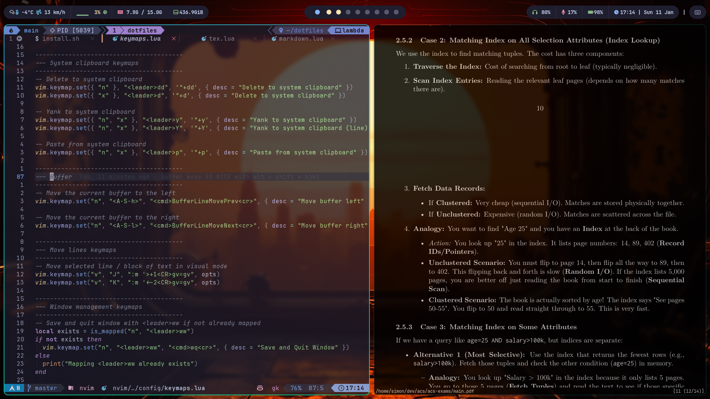

# dotfiles

My personal configuration files for Arch Linux, managed with GNU Stow.

## Setup

Symlink the configs (using stow)
```
stow nvim zsh ghostty tmux # etc...
```

I would like to make a full fledged installer script at some point, but I am also considering switching to NixOS so it may not be worth the effort, doesn't take 'long' to install manually with pacman and yay anyway.


## Look 'n feel (updated: Sunday 11th of January 2026)


