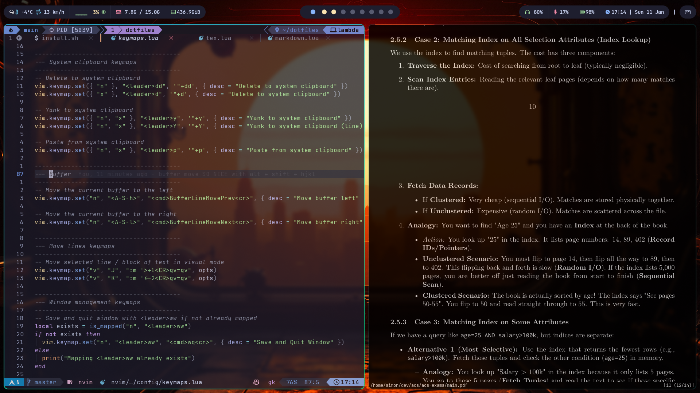

# dotfiles

My personal configuration files for Arch Linux, managed with GNU Stow.

The [wallpaper grid](background-grid/README.md) package includes the visual picker,
folder categories, keyboard navigation, wallpaper transitions, and setup steps
for both PCs.

## Setup

Symlink the configs (using stow)
```
stow nvim zsh ghostty tmux # etc...
```

I would like to make a full fledged installer script at some point, but I am also considering switching to NixOS so it may not be worth the effort, doesn't take 'long' to install manually with pacman and yay anyway.

## Sync desktop styling to the other PC

From the existing checkout on an Omarchy PC:

```sh
git pull --ff-only
stow -n -v hypr waybar ghostty oh-my-posh
stow -R hypr waybar ghostty oh-my-posh
CARGO_TARGET_DIR="$HOME/.cache/workspaces-slider-rs-target" cargo build --release --locked --manifest-path waybar/.config/waybar/workspaces-slider-rs/Cargo.toml
install -Dm755 "$HOME/.cache/workspaces-slider-rs-target/release/workspaces-slider" "$HOME/.local/bin/workspaces-slider"
```

The workspace slider must be rebuilt after source changes; its binary is not
stored in Git. Building needs Rust/Cargo, a C compiler, pkg-config, and Wayland
development files. The slider and bar use JetBrainsMono Nerd Font. The Hyprland
configuration uses the Lua API, so the other PC needs a compatible Hyprland
version (validated here with 0.56.2). Resolve any conflicts reported by the Stow
dry run before restowing.

Log out and back in after syncing to start the rebuilt slider and load the
desktop configuration. Keep `~/.local/bin` before `/usr/bin` in `PATH` so the
Waybar theme launcher is used. Switch appearance through `omarchy theme set`:
light themes such as `Catppuccin Latte` select the light bar, weather, workspace
slider, and shell prompt; dark themes select their dark versions. Ghostty's
`SimonLight` and `SimonDark` themes follow the system appearance set by Omarchy.


## Look 'n feel (updated: Sunday 11th of January 2026)


